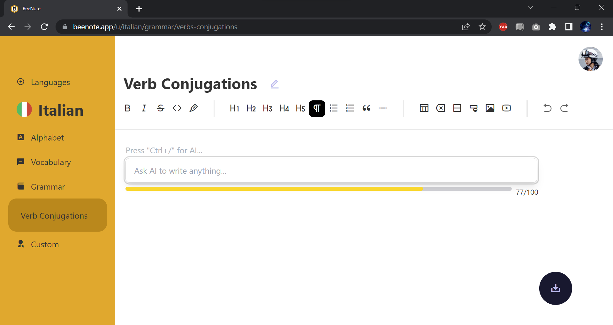

# BeeNote - Full stack CRUD application built with Next.js 13

***Tech stack: Next.js 13 + Tailwind + DaisyUI + PocketBase***

BeeNote is a full stack web application for taking language learning notes, built with Next.js 13. It utilizes Next.js 13's latest [app directory](https://beta.nextjs.org/docs/routing/fundamentals) feature for routing.

It is an app that can perform all the CRUD (Create, Read, Update and Delete) operations. There is a user system, where user can be created by signing up with emails. Once a user has logged in, he/she can add, update and delete alphabet and vocabulary entries, as well as grammar notes and custom notes. Users can also record and upload audios to help with pronunciation, and upload images for visualization. 

## Frontend

- Next.js 13 further blurs the line between frontend and backend. It provides routing, server-side rendering, client-side navigation, image optimization and more.

- TailwindCSS and DaisyUI are used for styling.

- The note editor is built with [Tiptap](https://tiptap.dev/).

## Backend

This app uses [PocketBase](https://pocketbase.io/) for database and user authentication.

## TODO

- [ ] Add helpful features like keypad for different languages.
- [ ] Add more signup options with OAuth2 providers.
- [ ] Implement drag-and-sort for alphabets and vocabularies.
